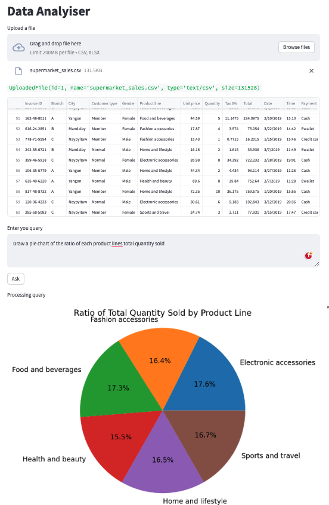

# PandaDataAnalyser
Streamlit pandaai OpenAI llm

plot  me the total money made for each product. Label the bars with the exact total. Give proper spacing to the x-axis, y-axis.
 Plot branch A in green, B in blue, C in red

 